<a href="https://github.com/Naitik1104">
  
  <svg viewBox="0 0 880 350" xmlns="http://www.w3.org/2000/svg" font-family="'JetBrains Mono','Fira Code',ui-monospace,'SFMono-Regular','Cascadia Code','Liberation Mono',monospace">
  <defs>
    <linearGradient id="cardBorder" x1="0" y1="0" x2="1" y2="1">
      <stop offset="0" stop-color="#30363D"/>
      <stop offset="1" stop-color="#1F6FEB" stop-opacity="0.35"/>
    </linearGradient>
    <linearGradient id="glow" x1="0" y1="0" x2="0" y2="1">
      <stop offset="0" stop-color="#58A6FF" stop-opacity="0.10"/>
      <stop offset="1" stop-color="#58A6FF" stop-opacity="0"/>
    </linearGradient>
  </defs>

  

  <!-- card background -->
  <rect x="1" y="1" width="878" height="348" rx="14" fill="#0D1117" stroke="url(#cardBorder)" stroke-width="1.5"/>
  <rect x="1" y="1" width="878" height="90" rx="14" fill="url(#glow)"/>

  <!-- chrome bar -->
  <line x1="1" y1="42" x2="879" y2="42" stroke="#21262D" stroke-width="1"/>
  <circle cx="28" cy="21" r="6" fill="#FF5F56" opacity="0.85"/>
  <circle cx="50" cy="21" r="6" fill="#FFBD2E" opacity="0.85"/>
  <circle cx="72" cy="21" r="6" fill="#27C93F" opacity="0.85"/>
  <text x="440" y="26" text-anchor="middle" class="chrome-title">naitik@github — zsh</text>

  <!-- prompt line -->
  <text x="32" y="75" xml:space="preserve"><tspan class="prompt-user">naitik</tspan><tspan class="prompt-sep">@github</tspan><tspan class="prompt-sep"> ~ </tspan><tspan class="prompt-cmd">whoami --stack</tspan></text>

  <!-- fields -->
  <g font-size="14">
    <!-- focus -->
    <text x="32" y="118" xml:space="preserve"><tspan class="field-label">focus</tspan><tspan class="field-dots">...............</tspan><tspan class="field-value">Applied ML </tspan><tspan class="field-accent">×</tspan><tspan class="field-value"> Full-Stack Engineering</tspan></text>

    <!-- languages -->
    <text x="32" y="150" xml:space="preserve"><tspan class="field-label">languages</tspan><tspan class="field-dots">...........</tspan><tspan class="field-value">TypeScript </tspan><tspan class="field-accent">·</tspan><tspan class="field-value"> Python </tspan><tspan class="field-accent">·</tspan><tspan class="field-value"> JavaScript</tspan></text>

    <!-- domains -->
    <text x="32" y="182" xml:space="preserve"><tspan class="field-label">domains</tspan><tspan class="field-dots">.............</tspan><tspan class="field-value">Computer Vision </tspan><tspan class="field-accent">·</tspan><tspan class="field-value"> Geospatial ML </tspan><tspan class="field-accent">·</tspan><tspan class="field-value"> Web Systems</tspan></text>

    <!-- shipping now -->
    <text x="32" y="214" xml:space="preserve"><tspan class="field-label">shipping now</tspan><tspan class="field-dots">........</tspan><tspan class="field-value">Cross-Cam-mapping</tspan><tspan class="field-accent">, </tspan><tspan class="field-value">Accessibility Mapper</tspan></text>

    <!-- repositories -->
    <text x="32" y="246" xml:space="preserve"><tspan class="field-label">repositories</tspan><tspan class="field-dots">........</tspan><tspan class="field-value">19 public</tspan><tspan class="field-accent"> · </tspan><tspan class="field-value">4 followers</tspan></text>

    <!-- achievements -->
    <text x="32" y="278" xml:space="preserve"><tspan class="field-label">achievements</tspan><tspan class="field-dots">........</tspan><tspan class="field-value">YOLO 🏆   Pull Shark 🦈</tspan></text>

    <!-- reach -->
    <text x="32" y="310" xml:space="preserve"><tspan class="field-label">reach</tspan><tspan class="field-dots">...............</tspan><tspan class="field-value">naitik-mehta-portfolio.vercel.app</tspan></text>
  </g>

  <!-- closing prompt + cursor -->
  <text x="32" y="338" xml:space="preserve"><tspan class="prompt-user">naitik</tspan><tspan class="prompt-sep">@github</tspan><tspan class="prompt-sep"> ~ </tspan></text>
  <rect x="172" y="326" width="9" height="16" class="cursor"/>
</svg>
</a>

  <a href="https://naitik-mehta-portfolio.vercel.app" target="_blank"><b>Portfolio</b></a> ·
  <a href="https://linkedin.com/in/naitik-mehta-a17774281" target="_blank"><b>LinkedIn</b></a> ·
  <a href="https://github.com/Naitik1104?tab=repositories" target="_blank"><b>All Repos</b></a>

 

 

## ✦ How I Think

I sit at the seam between **product engineering** and **applied machine learning** — I don't just wire up APIs, and I don't just train a model in a notebook and call it done. I like taking something intelligent and shipping it as software a real person can actually open: a map, a dashboard, a working pipeline.

That shows up in the shape of my work — **geospatial ML** that turns civic data into infrastructure decisions, **computer vision** that re-identifies tracked objects across independent camera feeds, and interfaces clean enough that the intelligence underneath doesn't need to shout about itself.

> **Right now:** deep in computer vision and geospatial ML — YOLOv11, tracking, cross-view identity mapping — while keeping my full-stack instincts sharp so the models I build actually reach a screen.

 

## ✦ Where I Operate

<table>
<tr>
<td valign="top" width="50%">

**Full-Stack Engineering**
 

</td>
<td valign="top" width="50%">

**Applied ML & Computer Vision**
 

</td>
</tr>
<tr>
<td valign="top" width="50%">

**Infra & Tooling**
 

</td>
<td valign="top" width="50%">

**Currently Sharpening**
 
<code>YOLOv11</code> <code>Object Tracking</code> <code>Cross-View Re-ID</code> <code>Geospatial ML</code>

</td>
</tr>
</table>

 

## ✦ Engineering, Selected

*A few projects that best represent how I build — out of 19 repos, these are the ones with real thought behind them.*

 

<table width="100%">
<tr>
<td width="50%" valign="top">

### 🗺️ [Accessibility Mapper](https://github.com/Naitik1104/Accesiblity_mapper)

An ML-driven geospatial platform that surfaces **public-service accessibility gaps across Mumbai** — fire stations, hospitals, and civic infrastructure scored against real population need, not just proximity on a map.

A Python ML layer feeds a React + Supabase frontend — built to answer a genuinely useful question: *where is a city underserved, and by how much?*

<code>TypeScript · 85%</code> <code>Python · 12%</code> <code>Supabase</code>

</td>
<td width="50%" valign="top">

### 🎥 [Cross-Camera Identity Mapping](https://github.com/Naitik1104/Cross-Cam-mapping)

A computer vision pipeline that re-identifies the **same tracked object across two independent camera feeds** — broadcast and tactical angles — using YOLOv11 detection and cross-view movement-pattern matching.

The kind of problem that sounds simple until the two cameras agree on nothing: not angle, not scale, not timing. 32 commits deep, with an outside contributor already forking in.

<code>Python · 100%</code> <code>YOLOv11</code> <code>OpenCV</code>

</td>
</tr>
<tr>
<td width="50%" valign="top">

### 🧭 [Saathi](https://github.com/Naitik1104/Saathi-Pympr1B)

A safety-first companion app with selfie verification, live chat, event discovery, and a dedicated user-discretion layer — built around one premise: **social features should protect people first, engage them second.**

<a href="https://saathi-pympr1-b.vercel.app">Live demo →</a>

<code>Python · 100%</code> <code>Facial Verification</code> <code>Real-time Chat</code>

</td>
<td width="50%" valign="top">

### 🌐 [Personal Portfolio](https://naitik-mehta-portfolio.vercel.app)

My digital front door — clean type, deliberate motion, zero unnecessary noise. Built to load fast and say exactly what needs saying, nothing more.

<code>Next.js</code> <code>Tailwind</code> <code>Design Systems</code>

</td>
</tr>
</table>

 

## ✦ Analytics

  

 

## ✦ Let's Build

I'm always up for a conversation about ML systems that ship, geospatial or computer-vision problems worth solving, or the occasional debugging horror story.

  

<i>Building things that are precise on purpose.</i>

